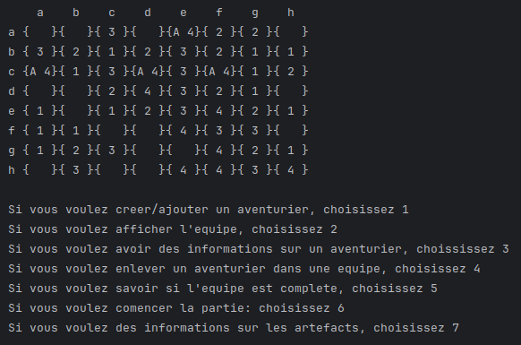
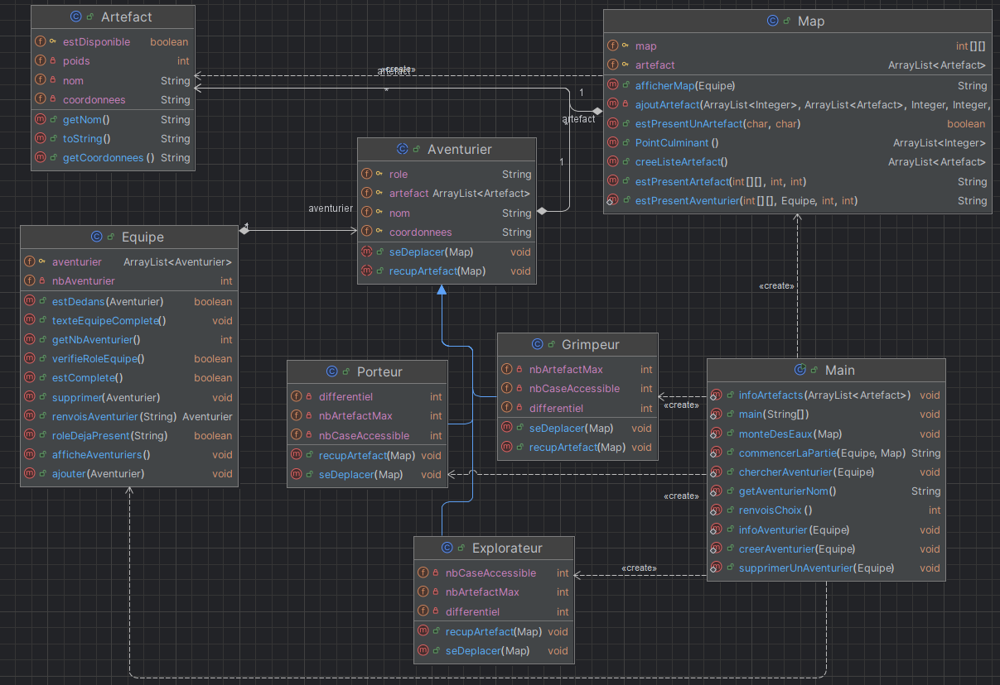

# L2_Jeu_Ile_Console_Java -> Projet L2 INFO305
Il s'agit d'un petit jeu en console réalisé par deux étudiants en L2 CMI informatique afin de répondre à l'un des TP de Java.

## Le jeu

### Pitch du jeu

Vous commencez avec l'interface ci-dessus. Créez-vous une équipe avec un **Porteur**, un **Grimpeur** et un **Explorateur** avant de vous lancer dans l'aventure du jeu. Vous devrez alors récupérer le plus d'artéfacts possible en exploitant le fait que les aventuriers ont des caractéristiques différentes en fonction de leur type. A vous de les découvrir (sinon référez-vous aux instructions de l'énoncé (**Sujet_Ile_Perdu.html**).

Attention, la montée des eaux vous guette :eyes: !

### Les commandes du jeu

Celles-ci sont très simples : suivez les instructions en console en répondant avec des chiffres !

### Diagramme des classes

Voici le diagramme des classes généré avec la version professionnelle de IntelliJ.

### Installation du jeu
#### Sur IntelliJ
Pour jouer, clonez le répertoire puis :
- Click droit sur Keyboard.Jar
- CLick gauche sur "Add as library..."
- Clickez sur Ok

Vous pouvez maintenant lancer le script à partir du fichier Main.

Note : IntelliJ indique parfois des erreurs autres que sur la librairie. ELle ne sont pas à prendre en compte, il n'y a pas d'erreur en réalité.

## Crédits
- PHILIPPE Teva
- FAUCON Chloé

## Compte rendu

Pour un compte rendu plus précis, référez-vous au fichier **Compte_Rendu_TP.docx**
